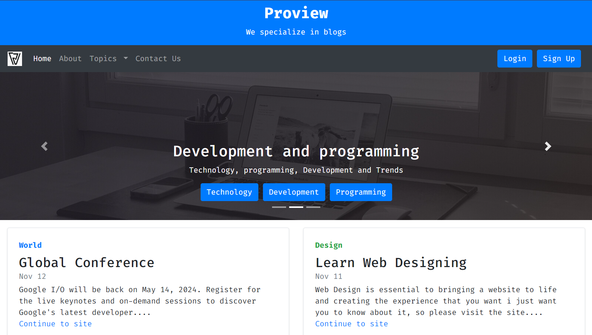

<!-- MasterHead -->

<h1 align="center">Hi 👋, This is a basic Blog website</h1>

<h3 align="center">💡 Just a plain project where you can explore courses.</h3>

<h3 align="center">📍 Focusing on web development (Front-end Platform).</h3>

    
    

<h3 align="center">Connect with me:</h3>

    

    <h4>Proview Website Link:</h4>
    
   

    

        

<b>📱 This is a simple Blog page, a Blog about technology component for
extra attention to featured content or information.</b>

